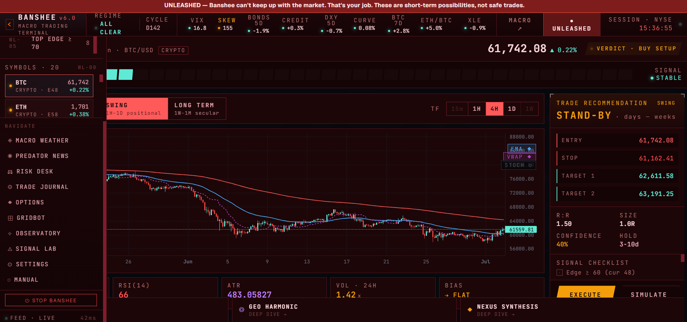
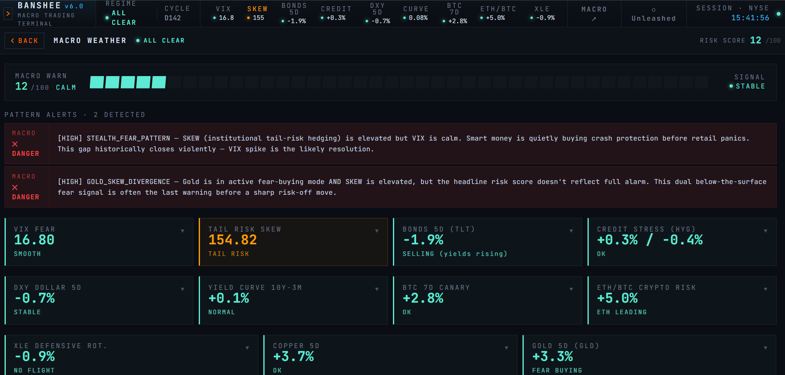
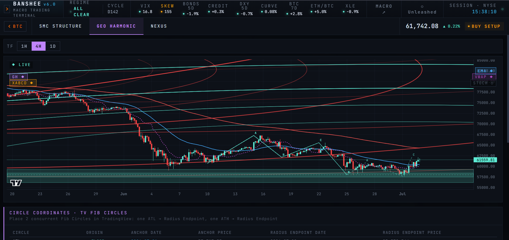
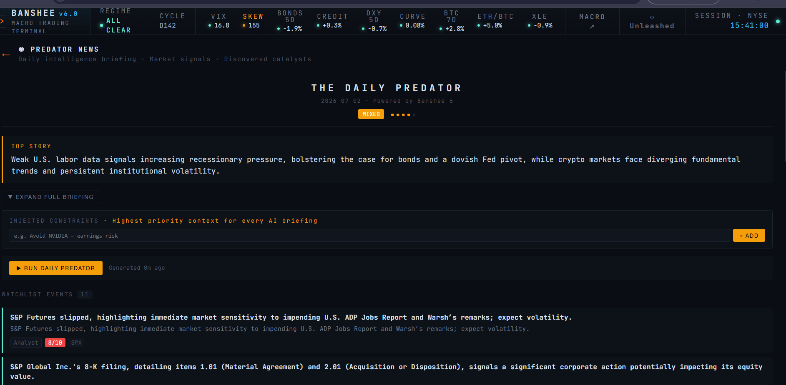

# Banshee 6

**A trading-analysis tool that runs entirely on your own computer.** Banshee watches the markets, spots the footprints institutional money leaves behind in price data, and explains — in plain English — what it's seeing. It flags; you decide. It never places a trade.

---

## What it does

- **Smart Money Concepts** — detects order blocks, fair-value gaps, break-of-structure, and liquidity sweeps across your watchlist, with optometry-style lenses to focus the read
- **Macro regime** — rolls Fed liquidity, rate posture, and economic conditions into a plain risk-on / risk-off call, plus a "stealth fear" sensor grid that catches divergences the headline numbers hide
- **AI briefings** — synthesizes macro + structure + signals + news into a written read, using your choice of provider (Gemini, Claude, OpenAI, or local Ollama)
- **Unleashed mode** — Banshee runs conservative by default ("when in doubt, wait"). Flip Unleashed and it widens the aperture, surfacing the spicier short-term setups *with the risk stated plainly*. You can even edit the AI's reasoning prompts per-surface to shape its voice yourself — safely, without touching the standard, guarded engine underneath
- **Options** — screens Wheel-strategy candidates (cash-secured puts) and bull-put spreads, tracks paper trades, and grades setups, teaching-first
- **Gridbot calculator** — sizes a grid setup and estimates returns for your capital and fees, with a paper tracker
- **Portfolio & journal** — an average-cost ledger, a portfolio evolution line, and a signal log that grades your past calls so you learn from them
- **Observatory** — every AI tool call is logged and auditable, so you can always see exactly what Banshee did and why
- **MCP server** — lets an AI agent (like Claude Code) talk directly to Banshee, pulling live analysis into your conversations
- **Pluggable data** — Coinbase, CoinGecko, Alpaca, yfinance, or your own REST endpoint, in a latency-ranked chain; opt-in per source, so Banshee is never locked to any single feed

---

## A look inside

**Macro Weather** — the sensor grid catching a *stealth fear* pattern: institutional tail-risk hedging (SKEW) is elevated while VIX stays calm, the kind of below-the-surface divergence the headline numbers miss.

**Geo-Harmonic** — harmonic arcs and an XABCD scan drawn over live price.

**The Daily Predator** — an AI news briefing that scores each catalyst by significance and folds it into every analysis.

---

## Quick start

**Requires:** Python 3.10+ and Node.js (any recent version).

1. Download or clone this repo
2. Double-click `launch_banshee.bat`
3. The launcher sets up the Python environment, installs packages, builds the UI, and opens `http://localhost:8765/ui/`

Everything runs locally. No cloud account needed to get started.

→ **Full setup:** [SETUP.md](SETUP.md) · **Using it day to day:** [MANUAL.md](MANUAL.md)

---

## API keys

All free. All stored locally in `~/.banshee_keys.json` — nothing leaves your machine.

| Key | Required | What for |
|-----|----------|----------|
| FRED API | Yes | Macro data (rates, liquidity) |
| AI provider | Yes | Written analysis (Gemini / Claude / OpenAI / Ollama) |
| Alpaca | Optional | Paper options trading |
| CoinGecko | Optional | Higher rate limits on crypto price data |

---

## How it was built

Banshee was designed and built by one person directing AI: the human brought the product vision, the market knowledge, the safety judgment, and the architecture; the AI wrote the code to that direction. It carries a full automated test suite and has been through adversarial security and code review. It's shared here both as a tool people can actually use and as a demonstration of what direction-first, AI-assisted development can produce.

---

## Disclaimer

Banshee is a research and analysis tool, not financial advice. It reads markets — it does not predict them. All paper trading features use fake money only. Never trade more than you can afford to lose.

---

